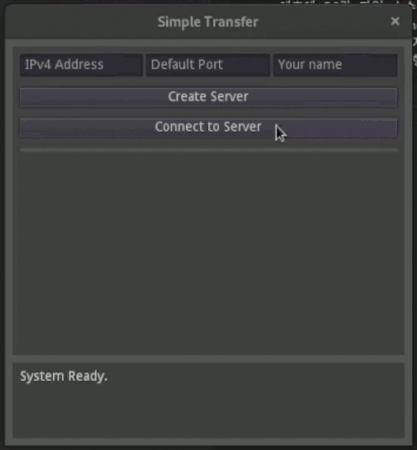
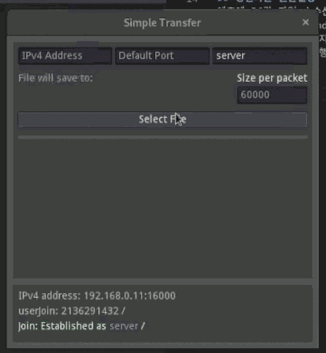
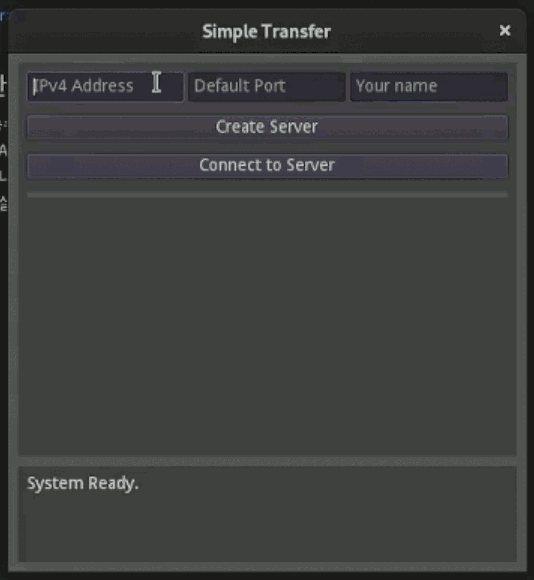
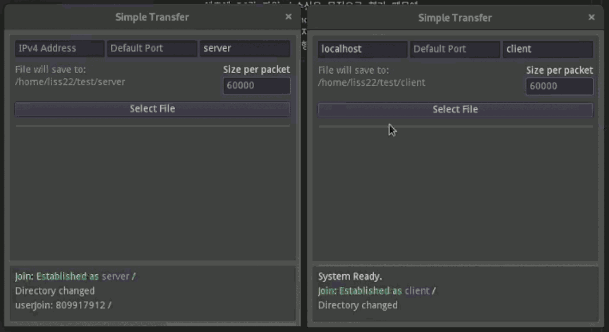
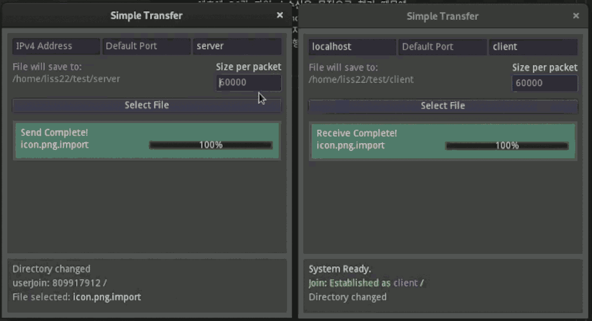
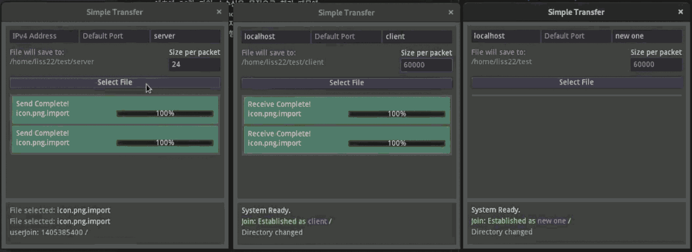
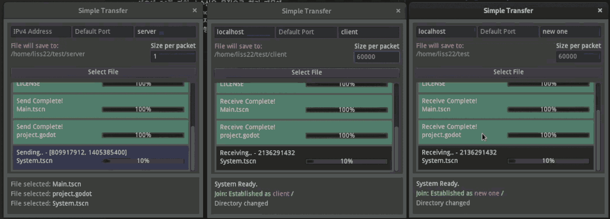

# 에... 파일 전송
아니 내가 이걸 시리즈물로 만들고 있다니  
다소 정신나간 것처럼 보이지만  
그저 파일 전송 연습으로 만들었습니다

여전히 Apple용으로는 출시되지 않습니다.. 없어요 아직도!

Windows: [window.zip](https://github.com/is2you2/ehh_transfer/raw/master/data/window.zip)  
Mac OSX: 출시되지 않음.  
Linux: [linux.zip](https://github.com/is2you2/ehh_transfer/raw/master/data/linux.zip)  
Android: [Simple_Transfer.apk](https://github.com/is2you2/ehh_transfer/raw/master/data/Simple%20Transfer.apk)  
iOS: 출시되지 않음.

## Android 정신나간 동작방식
처음에 PC간 파일 송수신을 목적으로 했기 때문에  
이 프로그램의 경우 Android에서는 이상적으로 동작하지 않습니다.  
권한 최소화를 위해 앱 내부에 파일을 저장하며, 앱을 삭제하면 전송과 연관된 모든 파일이 삭제됩니다.  

## 사용설명서
  
상단에 이름을 적고 서버를 시작합니다.  
그러면 아래쪽에서 서버 주소를 확인할 수 있습니다.

  
서버가 생성되면 상단 2번째 줄에서  
파일을 수신할 경우 저장할 공간을 선택합니다.

* 수신하는 파일은 무조건 덮어쓰기로 진행되기 때문에 새 폴더를 생성하여 작업하는 것을 권고합니다.
* 파일 수신시 검토작업을 하지 않기 때문에 운이 나쁜 경우 파일이 깨져있을 수 있습니다. (30년 컴퓨터 사용 중 딱 한 번 경험해봄)

  
클라이언트의 경우 서버 주소와 이름을 입력하고 접속하기를 누르면 됩니다.  
이 후에 수신 폴더 설정은 동일합니다.

* 수신 폴더 설정은 수신받을 컴퓨터에서만 설정하면 됩니다.
* 송신만 할 예정의 컴퓨터에서는 굳이 설정하지 않아도 동작합니다.

  
파일을 송신하려면 파일 선택 버튼을 클릭하여 파일을 선택한 후  
접속된 사람들 중 파일 수신을 원하는 사람을 선택하고 파일 전송을 누르시면 됩니다.

  
우측에서 한 번에 전송되는 크기를 설정할 수 있습니다.  
크기를 작게 하면 오래걸리게 됩니다.  
크기를 크게 하면 빠르게 전송되지만 일부 기기에서 지원되지 않을 수 있습니다.  
기본값으로 전송시 문제가 발생한다면 이 값을 줄여서 다시 사용해보세요.

  
한 번에 여러 파일을 여러 사람에게 보내는 것이 가능합니다.  
용량 문제로 촬영되지는 않았지만 이 과정 도중에 여러 파일을 받는 것 역시 가능합니다.  

  
파일 전송 도중에 연결이 끊기게 되면 하단에 끊긴 기록이 남지만  
화면 상에서 커다란 변화는 생기지 않습니다. 이 점에 유의해주세요.
